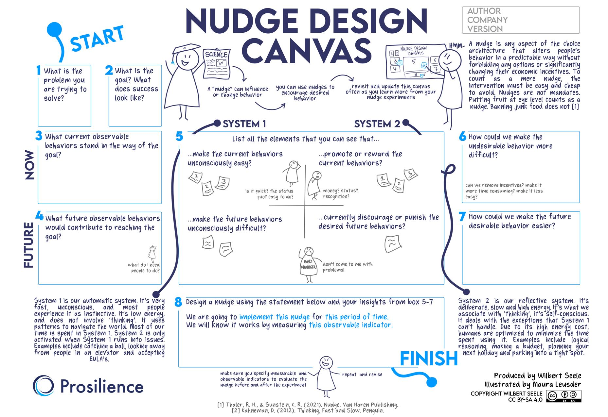
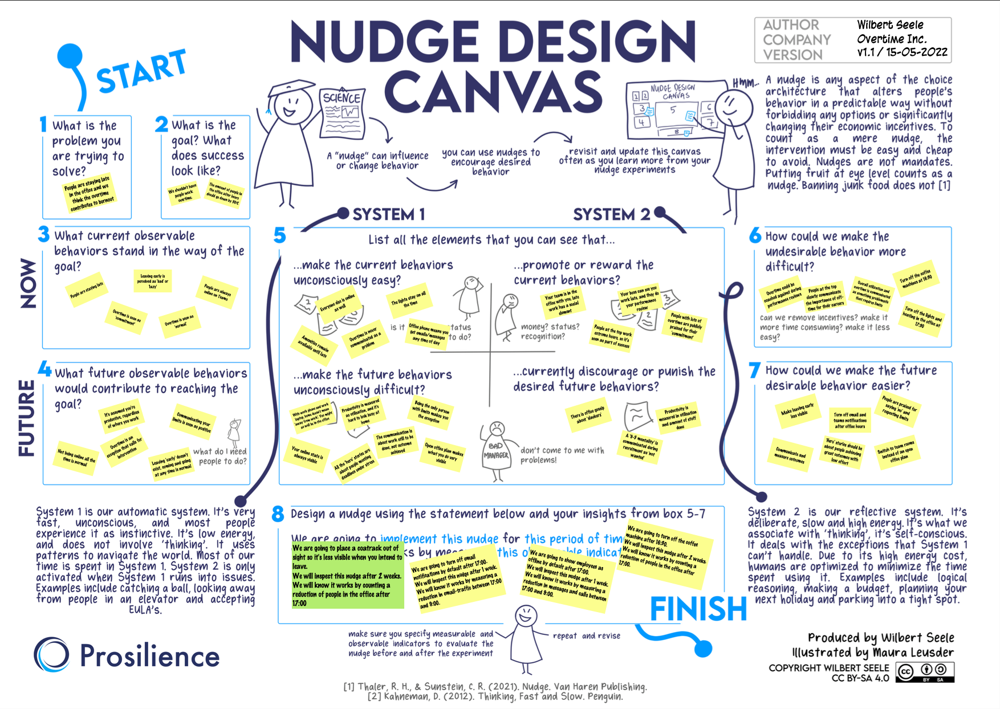
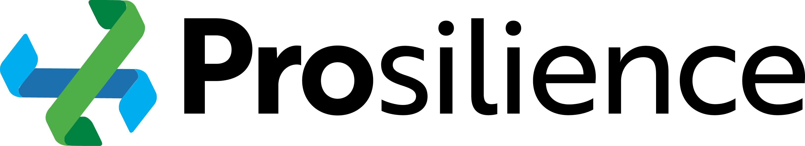

# The Nudge Canvas Facilitators Guide
## Introduction
Thanks for your interest in using the Nudge Canvas. I'm happy to see it being used, and happy you've decided to look into creating better environments for people. This guide is intended to enable you to use the Canvas yourself, or facilitate a group session around the Canvas. While there is no set agenda and timings for this, taking some time to prepare yourself before using it will pay off.

The latest version of the Nudge Canvas and this guide will always be available at [GitHub](https://github.com/wjseele/nudgecanvas).

The PDF version is sized for A0. It should also work for A1, but it'll be cramped. The JPG is intended for use in Mural/Miro. [You can find a Mural template here.](https://app.mural.co/template/7ddc0538-99a9-4f43-82dc-bae11bd757a2/cf9b708c-c96f-4628-80fe-8ca34ae5158a)

## Preparation
This guide won't go into detail on the how and why of nudges. This would be way too much text, and better sources exist. And speaking of those better sources: I'm going to advise you to read two books that lay at the foundation of this Canvas. The rest of the guide will assume you've read both. 

The first book you're going to read is *Thinking, Fast and Slow* by Daniel Kahneman. This book explains [System 1 and System 2](https://en.wikipedia.org/wiki/Thinking,_Fast_and_Slow#Two_systems), and how their interplay results in many logical fallacies and biases we see in every day behavior. These concepts are the foundations upon which nudges are built. Being able to explain them well, and in a concise manner, is key to facilitating others in the use of the Canvas.

The second book you're going to read is *Nudge: The Final Edition* by Richard Thaler & Cass Sunstein. This book explains not just [*Nudge Theory*](https://en.wikipedia.org/wiki/Nudge_theory) itself, but also the concept of [*choice architecture*](https://en.wikipedia.org/wiki/Choice_architecture) and the ethical principles in this field, something the authors call [*libertarian paternalism*](https://en.wikipedia.org/wiki/Libertarian_paternalism). Understanding these topics well will make the difference in whether you produce high effort, coercive or even mandatory interventions or actual nudges. 

The Nudge book in particular contains many examples and case studies. Familiarize yourself with some of them beforehand so you can inspire the group when it comes to designing experiments. Consider finding some examples of nudges in your own environment as well. Once you come to understand this material, you will see them all around you. This understanding is key as well when the subject of ethics comes up: We're already surrounded by nudges. All we're doing is becoming more aware of them, and making conscious choices around what we want to make easier or harder to do. 

## Understanding the Canvas

The Canvas promotes a flow through the nudge design process. Rather then rushing to experiments, my intent was that the user(s) spend a considerable portion of time understanding the current environment people are in. When the context is transparant, you'll find that it's much easier to design a small experiment with a clear outcome. Taking this time is also important to get people to fully consider the system 1 issues, as our default is to only consider system 2. 

The Canvas uses 4 points of view, which intersect in Step 5:
1. The Current State (NOW) - Steps 3, 5 and 6 - Aka the top row
2. The Desired State (FUTURE) - Steps 4, 5 and 7 - Aka the bottom row
3. System 1 - Step 5 left side
4. System 2 - Step 5 right side

By the time you finish step 7, you should have a holistic view of the gap between your current environment (or system, for the systems thinkers amongst us) and a future environment that would allow you to reach your intended goal. If at any time you find new information or gain new insights that would add to earlier made steps, just go back and add them. The Canvas is iterative, and should be a living document of insight and experiments. 

Step 8 contains an example nudge format to help with refinement. You can tell the group to stick to the format or just refer to it as a good starting point. The main reason it's there is to help keep the nudges small, actionable and measurable. Remember, if a nudge requires weeks of planning to implement, it's *probably* too big.

When you're done, your Nudge Canvas could look this this:

## Facilitating a group
Now that you understand the Canvas, let's go through it step by step:
1. Stating the problem
	
	This is all about **focus**. The clearer you're able to define the problem you're trying to solve with the group, the easier the rest of the session is going to be. Boundaries are your friend here. 'People aren't happy' isn't clear enough. 'People stay in the office too long' is. 

	The reason we start from a problem here, instead of starting with a goal straight away, is because I believe change should start from a place of need. It may be perceived as negative, but if we can't articulate why something needs to be better, maybe we shouldn't change things either. 
2. Stating the goal
	
	This is all about **outcome**. With a clear problem, you can proceed to define what success looks like. No solutioning here! Depending on your situation, you could introduce some measure of change here. Think 'Reduce the amount of people in the building after hours by 50%' or 'Overtime is down by 25%'. If the group is familiar with the concept, you could even formulate this with an OKR. 

	One question I've struggled with is whether to define a timespan or timebox for achieving this goal. I'm currently fine without it, as timeboxes are already an explicit part of designing a nudge in step 8. But you could absolutely add one here if that helps. In an EBM context, this is where you state your Intermediate Goal. 
3. Current problematic behaviors
	
	This is all about **transparancy**. There's no System 1 or System 2 here yet. What you're trying to do here is list all (or as many as possible) of the behaviors you observe that are contributing to the current problem, or detracting from the goal. More is better here, as it'll give the group more to go on in the next steps. 
4. Future desired behaviors
	
	This continues the theme of **transparancy**. Where step 3 is about making the current situation transparant, this step is about making our assumptions & desires for the future transparant. If we're in an environment where the problem is solved, and our goal achieved, what would we see there? Again, more is better here. 

	You might have lazy groups here that reply with 'the opposite of step 3'. Challenge them on this. There's often behaviors that are currently absent, that could be uncovered here. Again, the more you find in this step, the more options you have in the following steps.
5. The Big Analysis
	
	This is the big one. You're going to be spending most of your time here, probably at least half of the session. This step is all about **inspection**. This is also the part where your group will need the most help. If you ask them to just list why the current behavior is easy, they'll produce System 2 incentives almost exclusively, which can derail your session. 

	Start with explaining System 1 and System 2 here, even with groups familiar with the topic. You can do this yourself, or use a [TBR](https://www.bowperson.com/) approach. There's definitions on the Canvas to help you out with this part. 

	Emphasize that the analysis starts in System 1. What makes the current behavior unconsciously easy to do? What makes the desired behavior difficult to do? When the group generates examples, there's bound to be a few that a rooted in System 2 instead. This is fine, you can have them move these to System 2 and explain why. Continue to generate ideas based in System 1. You could run [Liberating Structures](https://www.liberatingstructures.com/) here to help populate this area, [1-2-4-All](https://www.liberatingstructures.com/1-1-2-4-all/) works here, but so does a [Conversation Cafe](https://www.liberatingstructures.com/17-conversation-cafe/). You're most likely going to find that as you keep the group focused on System 1 analysis, the System 2 side will still fill up slowly. 

	Round this part off by asking them to list the System 2 incentives that promote the current behavior, or policies that discourage or prevent the desired behaviors. With this list, have them check whether such incentives or policies might be rooted in System 1. Have them update the area accordingly. 
	By the time you finish this section your group should be inspired and energized. You'll likely have found tons of variables you can nudge on, and with such a wealth of options the group is likely to have all sorts of ideas. *If you find this area to be somewhat barren, you might need to go back a step and expand there*. 
6. Making undesired behavior harder
	
	This is where the Canvas moves into **adaptation**. At this point the group should have a good understanding of System 1 and System 2. Now you can start exploring options to make the currently unhelpful behavior harder. Be very clear here: Only System 1 options are allowed here. Be ruthless! These will be the seeds of your nudges, which you will be designing in step 8, and nudges are firmly rooted in System 1. 
7. Making desired behavior easier
	
	The **adaptation** continues here. Where the previous step was rooted in the present, this step is forward looking. Again, only System 1 options are allowed here. Many groups can still get stuck in System 2 focused incentives here, like rewards or trainings. Intervene early if you see this happen without challenge. 
8. Designing your nudge
	
	Time to turn all the options you generated in steps 6 and 7 into nudge experiments! As stated before, the goal here is to take what you generated before and make it small, actionable, measurable and timebound. The provided format can help here. You can give an example here, but make sure the example isn't related to the problem of this Canvas or you'll anchor the group. The sudden introduction of explicit measures and time might be jarring to a group. If they struggle with this, take the time to explain why this is important in the complex context of adjusting human behavior. 
	Consider starting this section by revisiting the definition of a nudge, which is provided on the Canvas. Remind the group of the importance of freedom of choice, and that a nudge should not trigger System 2 to activate. 

	You're going to end up with a backlog of possible nudges. You want the group to start with one, so have them use an ordering technique to figure out where to start. Something as simple as an effort & duration matrix could be useful here. The group will also see the benefit of designing smaller experiments here, as it'll allow them to try their other ideas sooner. 

	The goal is to end up with a single small nudge that can be implemented quick and cheap by the group. They might want to try multiple at once. This may not be a good idea from a measurability perspective, as you'll be changing many things at once and it'll be harder to find out which nudge worked. Many environmental changes at once could also trigger System 2, which we want to avoid.

## Next Steps
If you made it here, congratulations! Your group will have a nudge ready to implement, and a backlog of nudge experiments they can run next. Don't let it end here though!

Agree with the group when to meet next to update the Canvas. At the very least, this should be when the timebox on the current nudge experiment expires, but consider meeting before this time to inspect if change is already happening, or new information has emerged.

Until you've solved the problem and achieved the goal, the Nudge Canvas should remain a living document. And remember: we're trying to make it easier for people to focus on what really matters. Your nudges should never feel forced.

Good luck & have fun!

Wilbert Seele

(https://prosilience.consulting)

## Copyrights
The Nudge Canvas and this Facilitators Guide is licensed under Creative Commons Attribution-ShareAlike 4.0 International [(CC BY-SA 4.0)](https://creativecommons.org/licenses/by-sa/4.0/legalcode). 

